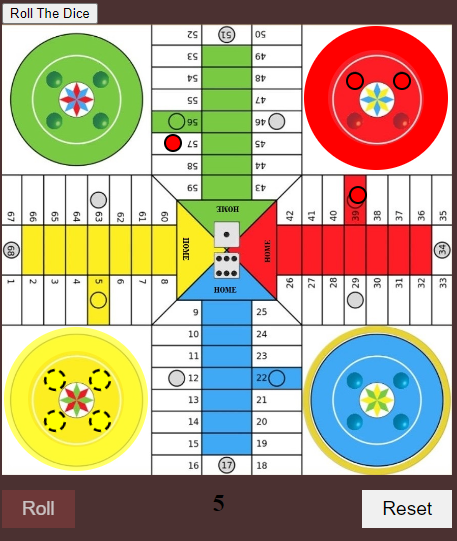

# Parcheesi star

Parcheesi Game
This is a simple Parcheesi game that can be played with multiple players. The game board consists of a track with colored spaces that represent different actions.

Getting Started
To play the game, simply clone this repository to your local machine or download the zip file. Once you have the files on your computer, open the index.html file in your preferred web browser.

How to Play
Each player starts with four pieces in the starting area. The objective of the game is to move all four pieces around the track and get them to the center of the board. The first player to move all their pieces to the center wins the game.

Players take turns rolling a six-sided die to determine how many spaces they can move. If a player rolls a five, they get to roll again. If a piece lands on a space occupied by an opponent's piece and not on a safe spot, the opponent's piece is sent back to the starting area.

Players can only move their pieces counterclockwise around the board, starting from the starting area. If a player cannot move any of their pieces, they lose their turn.

Game Features
Supports up to four players (comming soon)
Each player has four pieces
Simple and easy-to-use 
